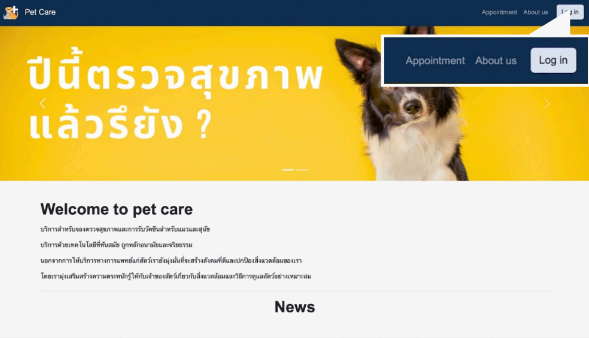

# 🐾 PetCare Clinic Management System

Developed in 2023 as a final project for the CP151 Web Programming course. This web-based application is a comprehensive management system for a pet clinic, featuring dual-sided interfaces for both pet owners (Clients) and clinic personnel (Admin/Staff).



## 🌟 Key Features

**Client Side**
* **User Authentication:** Secure Sign-in and Sign-up system for pet owners.
* **Pet Profile Management:** Users can add, view, and update their pets' medical information and profiles.
* **Appointment System:** Online booking for medical check-ups and vaccination schedules.
* **News Feed:** Access to the latest pet health news and clinic updates.

**Staff & Admin Side**
* **Data Visualization Dashboard:** An interactive dashboard using `Chart.js` to visualize clinic statistics and patient trends.
* **Content Management System (CMS):** A dedicated news posting module integrated with `CKEditor`, allowing staff to format text, add media, and publish pet care articles professionally.
* **Medical Management:** Tools to manage vaccination lists, update patient statuses, and monitor sick pets.
* **Appointment Handling:** A centralized interface to manage and track all incoming client appointments.

## 📁 Project Structure

```Plaintext
PetCare/
├── css/                # Stylesheets for CKEditor and Kanit fonts
├── font/               # Kanit font assets
├── image-upload/       # Multimedia storage
│   ├── avartar/        # User profile pictures
│   ├── news/           # News and article images
│   └── profile/        # Pet profile images
├── petcare/            # Client-side application files
├── staff_side/         # Staff/Admin side application files
│   └── js/             # JavaScript libraries including CKEditor
├── sql/                # Database scripts
│   ├── CREATE_DATABASE_PETCARE.sql
│   └── CREATE_TABLE_PETCARE.sql
└── connect.php         # Database connection configuration
```

## 🛠 Tech Stack
* **Languages:** PHP (Backend), HTML5, CSS3, JavaScript (Frontend)
* **Database:** MySQL
* **Libraries:**
   * **CKEditor:** Used for the rich-text editor in the news management module.
   * **Chart.js:** Powering the administrative dashboard for data visualization.

## ⚙️ Installation Guide
1. **Download the Project:** Clone or download the repository to your local machine.
2. **Prerequisites:**
   * Install XAMPP.
   * Launch the XAMPP Control Panel and start Apache and MySQL.
3. **Database Setup:**
   * Open phpMyAdmin at `http://localhost/phpmyadmin/`.
   * Import and run `sql/CREATE_DATABASE_PETCARE.sql` to create the database schema.
   * Import and run `sql/CREATE_TABLE_PETCARE.sql` to generate tables and insert initial data.
4. **Configuration:**
   * Open `connect.php` and verify the settings (Default XAMPP settings):
```PHP
$servername = "localhost";
$username = "root";
$password = "";
$dbname = "petcare";
```
5. **Deployment:**
   * Move the entire `PetCare` folder into your server directory: `C:\xampp\htdocs\`.

## 🚀 Accessing the System
* **Client Interface:** `http://localhost/G07_PetCare/petcare/`
* **Staff Interface:** `http://localhost/G07_PetCare/staff_side/`

## 🔑 Test Credentials
| Role               | Email            | Password |
|--------------------|------------------|----------|
| Admin              | admin@gmail.com  | admin    |
| Veterinarian (Vet) | vet@gmail.com    | vet      |

